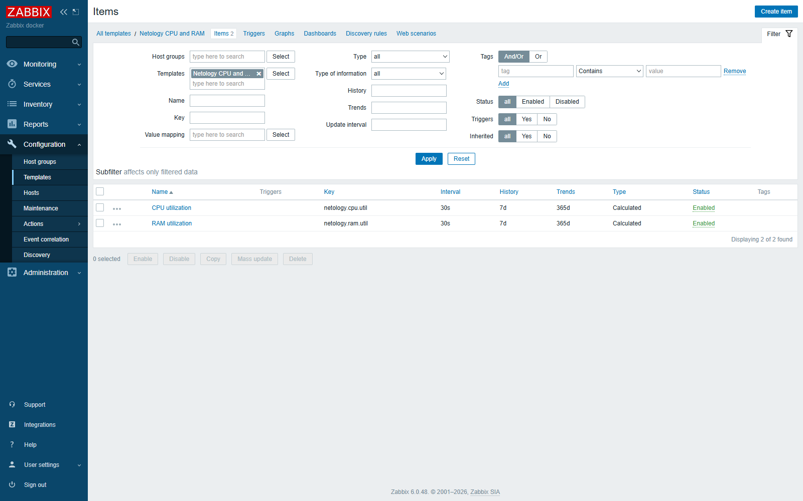
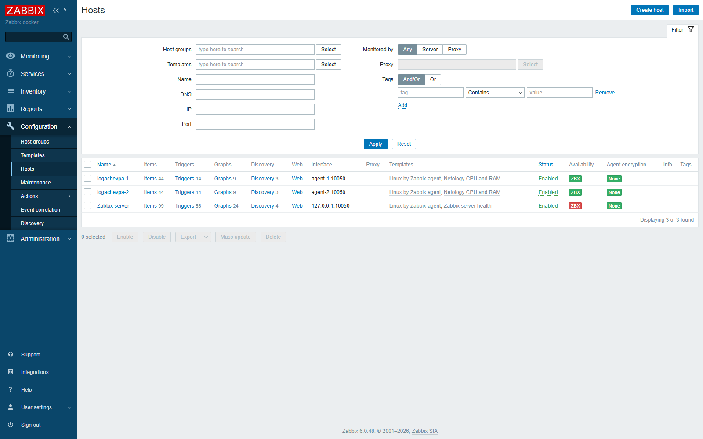
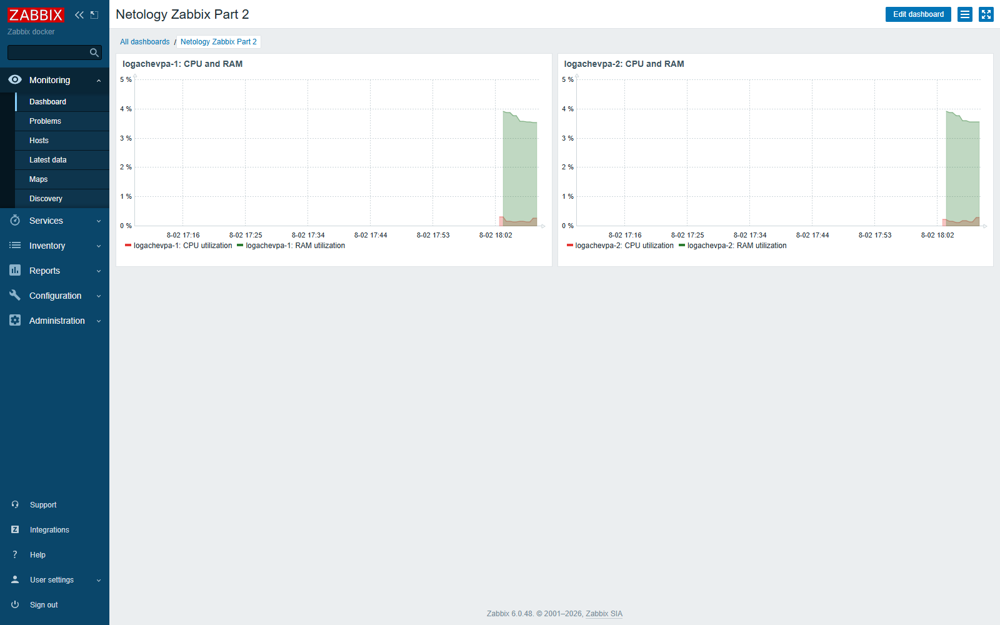

# Домашнее задание «Система мониторинга Zabbix. Часть 2»

**Студент:** Павел Алексеевич Логачев

**Поток:** ARZ-8

**Дата выполнения:** 2 августа 2026 года

## Стенд

Задание выполнено на воспроизводимом изолированном стенде Zabbix 6.0.48:

```text
Browser -> 127.0.0.1:18084 -> Zabbix Web
                                  |
PostgreSQL <- Zabbix Server ------+----> logachevpa-1 (Agent 2)
                                  +----> logachevpa-2 (Agent 2)
```

Все сервисы работают в отдельной Docker Compose network. Frontend и Zabbix Server опубликованы только на loopback; Agent 2 не публикует порт `10050` на хост. Два агента являются отдельными Linux hosts в приватной сети стенда. Конфигурация не использует платные облачные ресурсы и не затрагивает production.

Файлы для воспроизведения:

- [`compose.yaml`](compose.yaml) — PostgreSQL, Zabbix Server, frontend и два Agent 2;
- [`scripts/configure_zabbix.py`](scripts/configure_zabbix.py) — идемпотентное создание template, items, hosts, graphs и dashboard через Zabbix API;
- [`.env.example`](.env.example) — пример локального environment без секретов;
- [`evidence/api-verification.json`](evidence/api-verification.json) — итоговая API-проверка;
- [`evidence/service-status.txt`](evidence/service-status.txt) — состояние Compose и прямые `zabbix_get` проверки.

## Задание 1

Создан собственный template **Netology CPU and RAM** с двумя calculated items:

| Item | Key | Формула | Интервал |
|---|---|---|---:|
| CPU utilization | `netology.cpu.util` | `100-last(//system.cpu.util[,idle])` | 30 s |
| RAM utilization | `netology.ram.util` | `100-last(//vm.memory.size[pavailable])` | 30 s |

Оба item возвращают загрузку в процентах. Базовые значения поступают из стандартного template `Linux by Zabbix agent`.



## Задания 2–3

Добавлены два хоста:

- `logachevpa-1`, interface `agent-1:10050`;
- `logachevpa-2`, interface `agent-2:10050`.

К каждому хосту привязаны:

1. `Linux by Zabbix agent`;
2. `Netology CPU and RAM`.

На скриншоте у обоих хостов виден зелёный статус **ZBX**.



Получение свежих значений CPU и RAM от обоих хостов дополнительно проверено в **Monitoring → Latest data**:


Машиночитаемая проверка в [`api-verification.json`](evidence/api-verification.json) подтверждает для обоих interfaces `available: "1"`, отсутствие ошибок и четыре свежих значения со `state: "0"`.

## Задание 4

Создан custom dashboard **Netology Zabbix Part 2**. На нём размещены два SVG graph widgets — по одному на каждый хост. Каждый график содержит:

- CPU utilization — красная линия;
- RAM utilization — зелёная линия.



## Проверка и воспроизведение

```bash
cp .env.example .env
# Задать уникальный локальный POSTGRES_PASSWORD в .env
docker compose config --quiet
docker compose up -d
python scripts/configure_zabbix.py
```

Успешный итог API-скрипта:

```text
Zabbix API 6.0.48 is ready
{"templateid":"10643","hostids":{"logachevpa-1":"10644","logachevpa-2":"10645"},"dashboardid":"369","latest_values":4}
```

Прямой `zabbix_get` с Zabbix Server к каждому Agent 2 подтвердил:

- `agent.ping = 1`;
- получение `system.cpu.util[,idle]`;
- получение `vm.memory.size[pused]`.

После проверки стенд удаляется scoped-командой:

```bash
docker compose down -v
```

В решении нет конфиденциальных данных. Локальный `.env` исключён из Git.
