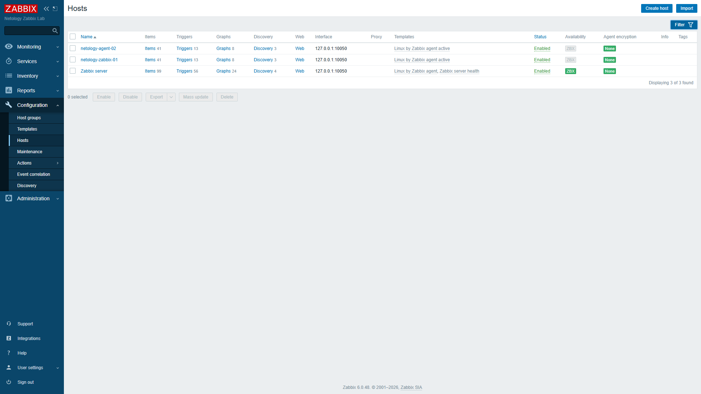
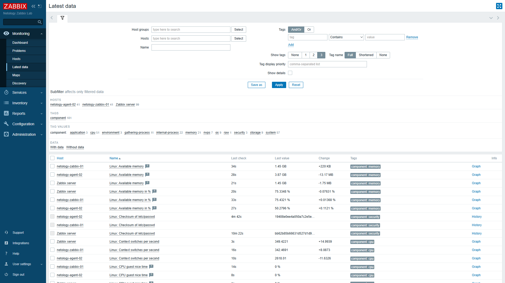

# Домашнее задание «Система мониторинга Zabbix»

Практика выполнена на реальной временной инфраструктуре 30 июля 2026 года.

## Результат

Развёрнуты и проверены:

- Zabbix Server **6.0.48 LTS**;
- PostgreSQL **13.23**;
- Apache **2.4.67** и PHP frontend;
- два Linux-хоста с Zabbix Agent 2;
- шаблон `Linux by Zabbix agent active` на обоих хостах;
- поступление значений от обоих агентов в `Monitoring → Latest data`.

| Компонент | Размещение | Режим |
|---|---|---|
| Zabbix Server, PostgreSQL, Apache | временная Debian 11 VM | server и frontend слушают только loopback |
| `netology-zabbix-01` | та же Debian 11 VM | системный Zabbix Agent 2, active checks |
| `netology-agent-02` | отдельная Linux VM | изолированный Docker-контейнер, active checks |

Второй агент соединялся с сервером через временный SSH-туннель. Порты `80`, `5432`, `10050` и `10051` не публиковались в интернет.

## Установка Zabbix Server

Для Debian 11 использована официальная ветка Zabbix 6.0 LTS:

```bash
curl -fsSL \
  'https://repo.zabbix.com/zabbix/6.0/debian/pool/main/z/zabbix-release/zabbix-release_latest_6.0+debian11_all.deb' \
  -o /tmp/zabbix-release.deb
sudo dpkg -i /tmp/zabbix-release.deb
sudo apt-get update
sudo apt-get install -y \
  zabbix-server-pgsql \
  zabbix-frontend-php \
  zabbix-sql-scripts \
  zabbix-agent2 \
  postgresql apache2 libapache2-mod-php php-pgsql
```

База создавалась отдельным пользователем. Настоящий пароль сгенерирован на VM, в Git не сохранялся:

```bash
sudo -u postgres psql -c "CREATE USER zabbix WITH PASSWORD '<DB_PASSWORD>'"
sudo -u postgres createdb -O zabbix zabbix
zcat /usr/share/zabbix-sql-scripts/postgresql/server.sql.gz \
  | sudo -u zabbix psql zabbix
```

Ключевые параметры `/etc/zabbix/zabbix_server.conf`:

```ini
DBName=zabbix
DBUser=zabbix
DBPassword=<DB_PASSWORD>
ListenIP=127.0.0.1
```

Apache получил alias `/zabbix` на `/usr/share/zabbix`, а frontend-конфигурация была сохранена в `/etc/zabbix/web/zabbix.conf.php`. После проверки конфигурации запущены сервисы:

```bash
sudo apache2ctl configtest
sudo systemctl enable --now postgresql apache2 zabbix-server zabbix-agent2
```

Фактические версии, состояния сервисов и bind-адреса: [`evidence/service-status.txt`](evidence/service-status.txt).

## Первый агент

Agent 2 установлен как systemd-сервис на временной Debian VM:

```ini
Hostname=netology-zabbix-01
Server=127.0.0.1
ServerActive=127.0.0.1
ListenIP=127.0.0.1
```

Лог успешного запуска: [`evidence/agent-vm.log`](evidence/agent-vm.log).

## Второй агент

Второй Agent 2 запущен отдельным Compose-проектом `netology-zabbix-01`:

```bash
cd /srv/netology-labs/zabbix-01/agent2
docker compose -p netology-zabbix-01 config -q
docker compose -p netology-zabbix-01 up -d
```

Конфигурация находится в каталоге [`agent2/`](agent2/). Контейнер:

- не публикует порты;
- работает в active mode;
- ограничен `0.25 CPU`, `128 MiB RAM`, `100 PIDs`;
- использует read-only root filesystem;
- соединяется с `127.0.0.1:11051`, перенаправленным SSH-туннелем на Zabbix Server.

Лог и runtime-проверка: [`evidence/agent-production.log`](evidence/agent-production.log).

## Хосты в Zabbix

Через Zabbix JSON-RPC API созданы два enabled-хоста в группе `Linux servers`:

1. `netology-zabbix-01`;
2. `netology-agent-02`.

Обоим назначен шаблон `Linux by Zabbix agent active`.



## Latest data

После запуска active checks значения появились у обоих хостов. На скриншоте видны, в частности, `Available memory`, `Context switches per second`, их `Last check` и `Last value`.



Дополнительная машинная проверка через API: [`evidence/api-verification.json`](evidence/api-verification.json). В ней сохранены версия Zabbix, статусы двух хостов, назначенные шаблоны и примеры последних значений; пароль и API-токен в файл не попали.

## Проверка

```text
Zabbix API: 6.0.48
PostgreSQL: active
Apache: active
Zabbix Server: active
Zabbix Agent 2 (VM): active
Zabbix Agent 2 (container): running, restart=0
Latest data: значения получены от двух хостов
Public ports у контейнера: отсутствуют
```

## Очистка временных ресурсов

После фиксации evidence и сдачи задания удаляются только ресурсы этой практики:

```bash
cd /srv/netology-labs/zabbix-01/agent2
docker compose -p netology-zabbix-01 down --volumes --remove-orphans
sudo systemctl stop netology-zabbix-tunnel.service
sudo rm -rf /srv/netology-labs/zabbix-01
```

Временная Debian VM удаляется отдельно в Yandex Cloud. Другие контейнеры, сети, volumes и проекты не затрагиваются.
